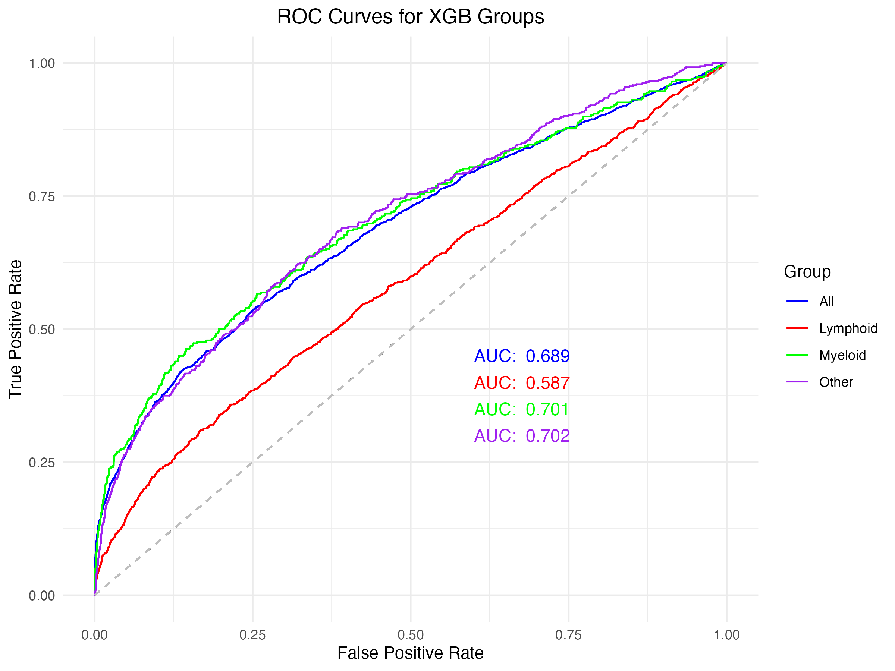

```{r eval=TRUE, echo=FALSE}
library(knitr)
library(kableExtra)
```


```{=tex}
\pagenumbering{gobble} 
\pagenumbering{arabic}
```

```{r setup, include=FALSE, echo = FALSE}
knitr::opts_chunk$set(echo = TRUE, message=FALSE, warning=FALSE, fig.align = "center", class.source='klippy')
```

```{r eval=TRUE, echo=FALSE}
setwd("~/Desktop/TDS/TDS_project")
```


# Introduction

Over 40,000 people are diagnosed with blood cancer each year in the UK, and over 250,000 people are currently living with blood cancer. [@bloodcancerukBloodCancerUK]. It is more common in adults age 60 and above but can also affect children, adolescents and young adults [@Kucine2020] Early diagnosis is key to improving health outcomes and reducing mortality. 

Blood cancers encompasses a broad range of cancers that are classified by the type of blood cell type that is affected in the mutation[@Arber2016]. Generally the disease is progressive and resulting in changes in cell types with increases or decreases in concentration of blood cells types depending on the blood cancer type and corresponding blood cell lineage affected. Blood cancers can be caused by genetic abnormalities causing abnormal changes in the formation of blood cells. Certain blood cancers such as myeloprolifeative neoplasts such as polycythaemia vera, essential thrombocythemia and myelofibrosis have been associated with mutations in the JAK2, CALR and MPL genes [@grinfeld2018] or FLT3 is most frequently detected in patients with AML[@dohnerPrecisionMedicineAML2021]. 

This has been a long term goal, back in 2014 one study demonstrated success in predicting leukaemia in patients based on the cell population data taken from full blood counts(FBC) using excel spreadsheet methods [@yang_determination_2014]. Machine learning (ML) has improved performance Previous studies have performed similar attempts with good results assessing specific blood cancers such as leukemia as well as more broad classifications with significant improvements in accuracy[@el-halees2017]. 

This method is not unique to blood cancer but has been applied to other health conditions and it was demonstrated that higher platelet ratio is associated increased in hospital mortaility in patients with myocarial infarction [@yaoRedBloodCell2023]

There are other approaches to use machine learning in diagnosis such as convoluted neural networks to identify abonormal leucocytes on histology slides with significant success however misclassification errors still exist especially between cell types that have similar lineage[@shahidsingh;@Wang2019]. 
 
Although there is literature available assess blood counts for specific blood cancer types there has not been any studies looking at a broad overview of blood cancers. Our aim is to investigate if it was possible early changes in blood cell concentrations that can be identified prior to diagnosis of blood cancer regardless of type. This could potentially identify an early cancer biomarker which could improve prediction of blood cancer diagnosis and allow for early intervention. We aimed to apply supervised and unsupervised machine learning techniques to identify blood biomarkers that could predict blood cancer and sub groups of blood cancer. This could protentially develop into a predictive model to assess for variables that could be a catalyst for research as well as improvement in clinical assessment to improve diagnosis, prognosis and treatment of myeloproliferative disease. 


# Methods:

The UK biobank was reviewed for patients with diagnosis of blood cancers according to ICD 10 and ICD 9 coding. We merged the ICD 9 and ICD 10 groups which had corresponding diagnosis according to the WHO classification for blood cancer (Arber et al. 2016). Our controls were retrieved from the UK Biobank and were identified as healthy participants with no ICD 10 & 9 diagnosis. We further grouped the blood groups according to the cell histology resulting in four subgroups classified as per the cell line: lymphoid, Myeloid, Dendritic and histiocytic cell and Other cancers.

Many FBC components are mathmatically related and so can be derived from each other. In order to prevent correlation and to ensure variables are independent we made a correlation matrix and removed correlated blood components. 

## XGBoost
We applied XGBoost (XGB) algorithm (@chenXGBoostScalableTree2016) to all cases and each subgroup. Each subgroup algorithm was trained and tuned using the caret package [@kuhnBuildingPredictiveModels2008] separately. The models were tuned with cross validation number 10 and 3 repeats. Cross validation was set at 10 times with a tuning of nrounds (500, 1000, 1500) with a max depth (2,4,6) eta (0.2), gamme (0), col sample_by tree (1) minchild weight (1) subsample (1). The default loss function was used:'binary:logistic'. This was applied to all cancer groups and the optimal settings was automatically passed onto a final model.

## Random Forest
Random Forest (RF) package was used [@liaw2002]. Each model was trained with repeated cross validation number 10 and 3 repeats tuning at 250,500,1000,1500 trees to find the optimal number of trees and m try (1 to 7) and optimal mtry and ntree was selected for each final random forest model for each cancer group. 


# Results

```{r, out.width='80%', fig.show='hold', echo=FALSE, fig.cap='ROC plots and AUC for XGB and Random Forest models', fig.pos = "H"}
# RF ROC plot combined image
knitr::include_graphics("combined_RF_ROC_plot.png")

# XGB ROC plot combined image

```
The AUC values demonstrate that the Random forest models are performed better than XGBoost across all cancer and subgroups. 

```{r, out.width='60%', fig.show='hold', echo=FALSE, fig.cap='Variable Importance Plots for XGB and Random Forest models', fig.pos = "H"}
# RF ROC plot combined image


# XGB ROC plot combined image

```

In order to compare feature importance for categorical prediction of both models and we selected the gain metric for XGBoost models and MeanDecreaseGini metric in Random Forest as these are similar indicators of which features used in splitting decision trees. These results are scaled and cut off was set at 80% variable importance.
The Mean decrease in Gini coefficient measures how each variable contributes to the homogeneity of the node and leaves in the resulting random forest. The higher the importance of the variable, the higher the value of the mean decrease gini score. The gain metric indicates the relative contribution of the feature by assessing the feature contribution to each tree in the XGB model - the higher the variable importance, the higher the contribution. 

# Discussion
Overall performance of the RF and XGB models determined by AUC value demonstrated that the RF models outperformed XGB models in all categories. Although the classification accuracy for either model is not high enough to compare to human standards and we do not have that information available to compare. The reason for the low accuracy we put forward is that each blood cancer category contains a very broad collection of blood cancer subcategories and performance may be improved a more refined categorization of blood cancers. 

Our feature importance plots more more features were identified as over the 80% importance in RF models for all cancer, lymphoid and other, but not for myeloid models. This is likely due to the design of the RF and XGB package in that in Randomn forest has a random selection of features when building trees and so more variables would be part of that selection process whereas in XGB uses boosting to combines weak learners sequentially to allow errors to correct the previous one. This would mean that few variables are selected rather than the random approach used by the RF algorithm. 
It is reassuring that similar variables are selected at over 80% in both algorithm and indicate that these are blood markers that should be further assessed and are potential identifiers of future cancer diagnosis however does not indicate if the variable is high or low that could be predicting cancer. The variables selected for lymphoid and myeloid are corresponding to the common cell progenitor are selected as a result. A red cell has a myeloid progenitor and is features highly in both XGB and RF models. The lymphocyte count is selected highly in XGB and RF models in the lymphoid group for the same reason. In the Other group, platelet count is a important feature in prediction which has a myeloid progenitor but the cancer types are heterogenous so it is more challenging to provide a reason why this is selected and should warrant further analysis of these subgroup cancers. 

In the RF model All and lymphoid BMI is a important variable to predict blood cancer and is supported with similar findings in the literature that BMI is a risk factor for all cancer [@taghizadehBMILifetimeChanges2015]. It is interesting that although most blood cancers have a genetic cause for them there is lifestyle factors such as BMI is a potential important feature in prediction for blood cancer. 

There are no other attempts at predicting broad cancer groups found in the literature to compare our models to although in comparison to human categorisation our models still need significant improvement. Some studies have used blood biomarkers to predict ovarian cancer using a range of ML methods and have similarly found that random forest algorithm performed the best although they have achieved much higher AUC results than our models liekly due to their more narrow objective [@kawakami2019; @ma2021].


# Limitations
The difficulty of having a broad base cancer classification approach is that cancer classifications are based on cell lineage affected and the cell type that is affected. We attempted to maintain that classification when we categorized into our 2 groups based on myeloid and lymphoid progenitor cells. It is more difficult with the other group not a homogenous cancer classification group and so is harder to interpret, this does make drawing clear conclusions from findings of Other group more challenging. 
We would aim to link with genomic data for better understanding of patient specific disease biology and develop precision medical intervention for each patient. 
This could also be developed into a risk stratification and prognosis but including more data such as treatment modality and deaths for predicting overall survival.


# References


# Supplement images

```{r, out.width='60%', fig.show='hold', echo=FALSE, fig.cap='Confusion Matrix Plots for XGB and Random Forest models', fig.pos = "H"}
# RF ROC plot combined image


# XGB ROC plot combined image

```

 