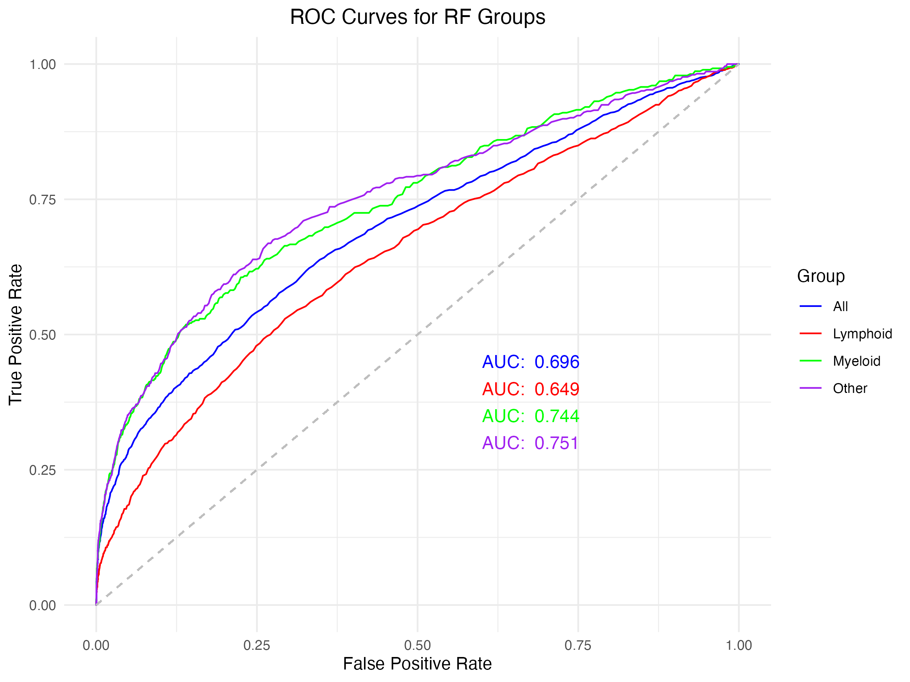
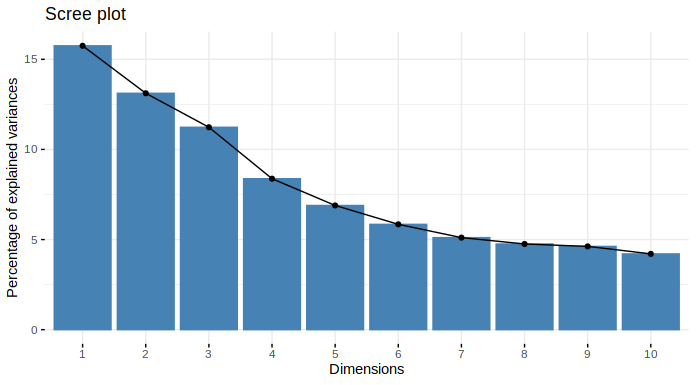

```{r setup, include=FALSE}
knitr::opts_chunk$set(echo = FALSE, eval = TRUE, comment = NA, fig.pos = "H", out.extra = "")
```

```{r packages, include=FALSE}
library(tableone)
library(tidyverse)
library(ggplot2)
library(gridExtra)
library(cowplot)
library(knitr)
source("../R/Functions_plot.R")
```

## Abstract
Blood cancer affects over 250,000 people in UK and early diagnosis is essential for early intervention and treatment to improve patient outcomes and reduce mortality. Blood tests are important diagnostic tests for multiple blood cancer types and blood counts are demonstrated to be predictive of cancer progress in other types of cancers. This study uses UK Biobank data on blood count and demographic and behavioural cofactors to develop models for blood cancer risk prediction. Stability selection was employed for variable selection, followed by fitting Cox proportional hazards models and logistic regression models for prediction. Tree based models such as random forest and XGBoost were also explored. Clustering has been applied to look for potential blood count profiles that are predictive of blood cancer risk. The methods are compared using C-index for time-to-diagnosis outcome and AUC for binary outcomes. 

This study found that red blood cell distribution width and platelet distribution width to be important factors for blood cancer risk prediction. These results are in coherent with previous results for other types of cancer. These could be incorporated into early diagnosis procedures. The blood counts found to be important in prediction can be used as early diagnosis indicators.


# Introduction


Over 40,000 people are diagnosed with blood cancer each year in the UK, and over 250,000 people are currently living with blood cancer. [@bloodcancerukBloodCancerUK]. It is more common in adults age 60 and above but can also affect children, adolescents and young adults [@Kucine2020]. Early diagnosis is key to improving health outcomes and reducing mortality. 

Blood cancers encompasses a broad range of cancers that are classified by the type of blood cell type that is affected in the mutation [@Arber2016]. Generally the disease is progressive and resulting in changes in cell types with increases or decreases in concentration of blood cells types depending on the blood cancer type and corresponding blood cell lineage affected. Blood cancers can be caused by genetic abnormalities causing abnormal changes in the formation of blood cells. Certain blood cancers such as myeloprolifeative neoplasts such as polycythaemia vera, essential thrombocythemia and myelofibrosis have been associated with mutations in the JAK2, CALR and MPL genes [@grinfeld2018] or FLT3 is most frequently detected in patients with AML [@dohnerPrecisionMedicineAML2021]. 

Using data for prediction of cancer has been a long term goal in medicine, back in 2014 one study demonstrated success in predicting leukaemia in patients based on the cell population data taken from full blood counts(FBC) using excel spreadsheet methods [@yang_determination_2014]. Machine learning (ML) has improved performance. Previous studies have performed similar attempts with good results assessing specific blood cancers such as leukemia as well as more broad classifications with significant improvements in accuracy[@el-halees2017]. 

This method is not unique to blood cancer but has been applied to other health conditions and it was demonstrated that higher platelet ratio is associated increased in hospital mortaility in patients with myocardial infarction [@yaoRedBloodCell2023].

There are other approaches to use machine learning in diagnosis such as convoluted neural networks to identify abnormal leucocytes on histology slides with significant success however misclassification errors still exist especially between cell types that have similar lineage [@shahidsingh;@Wang2019]. 
 
Although there is literature available demonstrating prediction using blood counts for specific blood cancer types there has not been any studies aiming for prediction across a broad category of blood cancers. Our aim is to investigate if it was possible to identify early changes in blood cell concentrations present prior to diagnosis of blood cancer regardless of type in order to predict cancer. This could potentially identify an early cancer biomarker which could improve prediction of blood cancer diagnosis and allow for earlier intervention. 

We aimed to apply supervised and unsupervised machine learning techniques to identify blood biomarkers that could predict blood cancer and sub groups of blood cancer. This could potentially develop into a predictive model to assess for variables that could be a catalyst for research as well as improvement in clinical assessment to improve diagnosis, prognosis and treatment of myeloproliferative disease. 

## Methods

### Data processing
UK biobank data was reviewed for patients with diagnosis of blood cancers according to ICD 10 and ICD 9 coding. We merged the ICD 9 and ICD 10 groups which had corresponding diagnosis according to the WHO classification for blood cancer [@Arber2016]. If there was not a corresponding ICD10 code for the ICD9 code then this was added to the Other cancer group. Our controls were retrieved from the UK Biobank and were identified as healthy participants with no ICD 10 & 9 diagnosis. We further grouped the blood groups according to the cell histology resulting in four subgroups classified as per the cell line: lymphoid, Myeloid, Dendritic and histiocytic cell and Other cancers.

Many FBC components are mathematically related and so can be derived from each other. In order to prevent correlation and to ensure variables are independent we calculated the correlation between each pair of variables and removed correlated blood components.

```{r Data cleaning, fig.cap="Data cleaning process.", out.width = '70%', fig.align='center'}
knitr::include_graphics("Data_cleaning.png")
```
We further grouped the blood groups according to the cell histology resulting in four subgroups classified as per the cell line: lymphoid, myeloid, dendritic and histiocytic cell and other cancers. The Dendritic and Histiocytic cell group had a low number and it was not large enough to be assessed so we removed it. 

After data cleaning, the dataset is split into train (75%) and test (25%) set. k-nearest neighbour imputation is used to impute missing values separately in train and test set. Cases and controls are matched to 1:1 on age, sex and date of recruitment in the train set.

### Stability selection
Stability selection on Cox regression (blood cancer case-control status) and logistic regression (blood cancer subtype case-control status) was performed using the sharp package in R [@bodinier2021automated]. All covariates and blood count features were supplied to the models, the penalty factor argument was set to 0 for all covariates to keep them in all models and to 1 for blood count features to select a subset of blood count features. Two parameters, penalty parameter ($\lambda$) and selection proportion ($\pi$), are tuned by subsampling and maximising the stability score. A grid of parameter values was defined using the default setting in the `VariableSelection` function, which uses a sequence from 0.6 to 0.9 with 0.01 interval for $\pi$ and `LambdaGridRegression` function for generating $\lambda$ values. For each pair of parameter values, 100 models were built using subsamples from the training data. The stability score was defined using a likelihood function that measures the deviation from an unstable model that uniformly selects features and the most stable models would stably select and exclude blood count features across 100 iterations.  

After stability selection, unpenalised Cox regression and logistic regression models were fit using all covariates and the selected blood counts. The models are used to predict outcome in the test set and compared to the true outcomes. C-index and AUC are calculated for time-to-event and binary outcomes, respectively.

### XGBoost
We applied XGBoost (XGB) algorithm to all cases and each subgroup [@chenXGBoostScalableTree2016] . Each subgroup algorithm was trained and tuned using the caret package separately [@kuhnBuildingPredictiveModels2008]. The models were tuned with repeated cross validation number 10 and 3 repeats. Cross validation was set at 10 times with a tuning of nrounds (500, 1000, 1500) with a max depth (2,4,6) eta (0.2), gamme (0), col sample_by tree (1) minchild weight (1) subsample (1). The default loss function was used:'binary:logistic'. This was applied to all cancer groups and the optimal settings were selected based on highest accuracy.

### Random Forest
Random Forest (RF) package was used [@liaw2002]. Each model was trained with repeated cross validation number 10 and 3 repeats tuning at 250,500,1000,1500 trees to find the optimal number of trees and m try (1 to 7) and optimal mtry and ntree was selected by highest optimal OOB accuracy and computational efficiency for each final random forest model for each cancer group.

### Clustering
Cluster analysis was performed on blood counts to explore potential groups of observations that are associated with blood cancers, as well as to reduce dimensionality for further analysis.
After clusters were found, a logistic regression of cluster membership against blood counts was performed to characterise the groups and determine which variables determine the cluster membership. 
Then, logistic regression model of blood cancer outcome against clusters and covariate were also fitted. This model was then used to predict the outcome in the test set. The predictions are compared to true outcome and AUC were calculated.
These models were then compared with the performance of regression models resulting from other models.

#### Clustering
Cluster analysis was performed on blood counts to explore potential groups of observations that are associated with blood cancers, as well as to reduce dimensionality for further analysis. Multiple clustering methods and distance metrics were explored, K-Means clustering was implemented using sharp package in R [@bodinier2021automated], pam was done using the package cluster (ref) and consensus clustering is done using the package ConsensusClusterPlus.

For each method, once cluster membership had been determined, a 70-30 train-test split was applied to the dataset. A logistic regression model of blood cancer outcome against clusters and covariates was then fitted on the training dataset. This model was then used to predict the outcome of each participant in the testing dataset. The ROC and AUC of these predictions were then calculated and compared with the performance of logistic regressions using just blood counts and covariates. For KMeans clustering, the number of clusters must be determined a priori. The Elbow and Silhouette methods were used, and the best number of clusters was identified based on both. Consensus clustering was performed based on K-Means or PAM clustering. The best number of clusters is defined using the change in area under consensus CDF. For simlpicity in presentation, consensus K-Means and PAM would be refered to as C-KM and C-PAM in the rest of the report.

## Results
```{r TableOne, results='asis'}
# import data
tab <- read.csv("../output/TableOne.csv")
# remove colname for the variable column
colnames(tab)[2] <- " "
# keep leading white space
tab$` ` <- gsub(" ", "&nbsp;", tab$` `, fixed=TRUE)
# get the table
kable(tab[,2:4], caption = "Demographics of the matched dataset.", align = "lrr")
```

### Comparison of model prediction accuracies
```{r Compare Cox regression, results='asis'}
# import data
tab1 <- read.csv("../output/Model_comparison_all.csv")
tab1$Model[4] <- "C-KM"
# get the table
kable(tab1, caption = "Comparison of Cox regression models using stably selected blood count features and using covariates only.", align = "llr")
```
```{r Compare logistic, results='asis'}
# import data
tab2 <- read.csv("../output/Model_comparison_together.csv")
colnames(tab2)[7] <- "C-KM"
# get the table
kable(tab2, caption = "Comparison of classification models. The model evaluation metric used is AUC. The outcomes are binary case-control statuses for pooled blood cancer types or subtypes. The 'Covariates' models are logistic regression models containing only the covariates. The 'Stability selection' models are logistic regression models containing covariates and selected blood count features. The clustering models are logistic regression models containing covariates and the cluster membership variables.", align = "lcccc")
```
Overall, including blood count features in modeling increases the accuracy of the models. Random forest models have the best performance for all outcomes.

### Stability selection

#### Cox regression
Seven blood count features are stably selected for the time to blood cancer diagnosis outcome. In the unpenalised model, immature reticulocyte fraction was removed due to having extremely large hazard ratio. The removal did not affect the model accuracy. For the other variables, higher red blood cell count is associated with lower hazard of blood cancer diagnosis, whereas red blood cell distribution width and platelet distribution width are found to associated with higher hazard (Fig. 2).

#### Logistic regression
For the blood cancer subtypes, seven blood count features were selected for lymphoid, four for myeloid and six for other types of blood cancers. Among the selected features, red blood cell distribution width was selected for all subtypes.Platelet distribution width and mean corpuscular volume are selected for both myeloid and other types. Red blood cell count and white blood cell count are selected for both lymphoid and other types (Fig. 3).

```{r Cox regression, fig.cap="Results for Cox regression model. A shows the selection proportion for each blood count feature, the stably selected features are labeled in red. B shows the hazard ratios for an unpenalised Cox regression model fitted using selected blood counts (orange) and all covariates (blue)."}
# selprop plot
df_selprop <- readRDS("../output/Reg_Cox_Selprop.rds")
p1 <- plotVarImp(data = df_selprop, varname = 1, varimp = 2, cutoff = 0.9)
# forest plot
df_forest <- readRDS("../output/out_coxph.rds")
df_forest <- df_forest %>% filter(p <= 0.05)
df_forest$varname <- factor(df_forest$varname, levels = df_forest$varname)
df_forest$IsBC <- as.factor(c(rep("Covariate",11), rep("Blood count",6)))
p2 <- plotForest(data = df_forest, 
                 varname = 8, estimate = 2, CI_l = 6, CI_u = 7, IsBC = 9,
                 typeOfEstimate = "Hazard Ratio", title = "")
# arrange plots
ggdraw() +
  draw_plot(p1, 0, 0, .40, 1) +
  draw_plot(p2, .40, 0, .60, 1) +
  draw_plot_label(c("A", "B"), c(0, .60), c(1, 1), size = 10)
```

```{r Logistic ss, fig.cap="Stability selection results for logistic regression against blood cancer subtypes."}
df_selprop <- readRDS("../output/log_selprop.rds")
p1 <- plotVarImp2(data = df_selprop, varname = 1, varimp = 2, model = 4, cutoff = 0.9)
ggdraw() +
  draw_plot(p1, 0, 0, 1, .50)
```
The unpenalised logistic regression models found the selected blood counts to be significantly associated with the outcomes, except for white blood cell count for lymphoid type, which is marginally significant (*p* = 0.055). Red blood cell distribution width is found to associated with higher odds of developing all the subtypes, consistent with the result found for blood cancer in general. Platelet distribution width and mean corpuscular volume are found to increase the odds of myeloid and other types of blooc cancer, also consistent with the results for pooled blood cancer. Red blood cell count was found to associate with lower odds of lymphoid and other types of blood cancer, again consistent with the pooled result. For lymphoid type cancer, platelet crit was found to associate with lower odds and the count of lymphocyte and monocyte, two types of white blood cells, are found to associate with high odds of lymhpoid type blood cancer. Ir fraction is again removed from the unpenalised model of myeloid type blood cancer due to an extremely high OR. The removal improved the model accuracy marginally from AUC = 0.69 to AUC = 0.70.
```{r Logistic, out.width='50%', fig.show='hold', fig.cap="Unpenalised logistic regression results for blood cancer subtypes."}
# All
df_all <- readRDS("../output/log_all.rds")
df_BC <- subset(df_all, IsBC == "Blood count")
df_all <- df_all %>% filter(`p-value` <= 0.05 & IsBC != "Blood count")
df_all <- rbind(df_all, df_BC)
df_all$varname <- factor(df_all$varname, levels = df_all$varname)
p1 <- plotForest(data = df_all, 
                 varname = 5, estimate = 1, CI_l = 2, CI_u = 3, IsBC = 6,
                 typeOfEstimate = "Odds Ratio", title = "All")

# Lymphoid
df_lym <- readRDS("../output/log_lym.rds")
df_BC <- subset(df_lym, IsBC == "Blood count")
df_lym <- df_lym %>% filter(`p-value` <= 0.05 & IsBC != "Blood count")
df_lym <- rbind(df_lym, df_BC)
df_lym$varname <- factor(df_lym$varname, levels = df_lym$varname)
p2 <- plotForest(data = df_lym, 
                 varname = 5, estimate = 1, CI_l = 2, CI_u = 3, IsBC = 6,
                 typeOfEstimate = "Odds Ratio", title = "Lymphoid")

# Myeloid
df_mye <- readRDS("../output/log_mye.rds")
df_mye <- df_mye %>% filter(`p-value` <= 0.05 & varname != "(Intercept)")
df_mye$varname <- factor(df_mye$varname, levels = df_mye$varname)
p3 <- plotForest(data = df_mye, 
                 varname = 5, estimate = 1, CI_l = 2, CI_u = 3, IsBC = 6,
                 typeOfEstimate = "Odds Ratio", title = "Myeloid")

# Other
df_oth <- readRDS("../output/log_other.rds")
df_oth <- df_oth %>% filter(`p-value` <= 0.05 & varname != "(Intercept)")
df_oth$varname <- factor(df_oth$varname, levels = df_oth$varname)
p4 <- plotForest(data = df_oth, 
                 varname = 5, estimate = 1, CI_l = 2, CI_u = 3, IsBC = 6,
                 typeOfEstimate = "Odds Ratio", title = "Other")

# arrange plots
p1
p2
p3
p4
```

### Tree-based methods
The AUC values demonstrate that the random forest models performed better than XGBoost across all cancer and subgroups. The prediction accuracy for XGB models of all subtypes were similar except for lymphoid type.
```{r, out.width='50%', fig.show='hold', fig.cap='ROC curves and AUC for random forest and XGBoost models', fig.pos = "H"}
# RF ROC plot combined image


# XGB ROC plot combined image
knitr::include_graphics("David_Report/combined_XGB_ROC_plot.png")
```

In order to compare feature importance for categorical prediction of both models and we selected the gain metric for XGB models and Mean Decrease Gini metric in RF as these are similar indicators of which features used in splitting decision trees. These results are scaled and cut off was set at 80% variable importance.
The Mean decrease in Gini coefficient measures how each variable contributes to the homogeneity of the node and leaves in the resulting RF. The higher the importance of the variable, the higher the value of the mean decrease gini score. The gain metric indicates the relative contribution of the feature by assessing the feature contribution to each tree in the XGB model - the higher the variable importance, the higher the contribution. 

```{r Varimp, fig.show='hold', fig.cap='Variable Importance Plots for random forest (top) and XGB (bottom) models. The top 5 variables for all models are coloured in red.'}
df_rf <- readRDS("../output/RF_varimp.rds")
df_xgb <- readRDS("../output/XGB_varimp.rds")
p1 <- plotVarImp3(data = df_rf, varname = 2, varimp = 1, model = 3, criteria = 4)
p2 <- plotVarImp4(data = df_xgb, varname = 2, varimp = 1, model = 3, criteria = 4)
p1
p2
```

### Clustering
The Elbow and Silhouette methods indicate that the optimal number of clusters is 4 (Fig. 7).
```{r Cluster number, fig.show='hold', out.width = '70%', fig.align='center', fig.cap="The number of clusters is determined using silouette scores."}
par(mfrow=c(1,3))

```
The clusters are visualised on a grid using PC1 and PC2 from a PCA of blood counts. Consensus clustering using K-Means identified four distinguishable clusters. Cluster 1 is similar between PAM and consensus K-Means. Cluster 4 from PAM is a combination of cluster 3 and 4 from consensus K-Means. Cluster 2 and 3 from PAM are not clearly separated.
```{r Visualise cluster, out.width='70%', fig.cap="Visualisation of clustering results using PC1 and PC2 from PCA of blood count variables."}
df_pc <- readRDS("../output/ClusPCA.rds")
colnames(df_pc)[3:4] <- c("pam4", "kmCons4")
p1 <- ggplot(data = df_pc, aes(x = PC1, y = PC2, color = pam4)) + 
  geom_point(alpha = 0.5) +
  labs(color = "PAM") +
  theme(legend.position = "bottom")

p2 <- ggplot(data = df_pc, aes(x = PC1, y = PC2, color = kmCons4)) + 
  geom_point(alpha = 0.5) +
  labs(color = "Consensus KM") +
  theme(legend.position = "bottom")

# arrange plots
ggdraw() +
  draw_plot(p1, 0, 0, .50, .70) +
  draw_plot(p2, .50, 0, .50, .70)
```
Looking at the distribution of blood counts across the clusters (Supplementary Fig. 2 & 3), the variables can be grouped into three large groups, WBC related, RBC related and platelet related. A summary of cluster characteristics for consensus K-Means clusters is presented in Table (x). Cluster 4 is characterised by high WBC related counts while the other clusters have similar levels. Looking at RBC related counts, cluster 1 has large amount of RBC but small size, small variation and low amount of Hb per RBC. Cluster 3 is characterised by small size and low amount of mean Hb but larger size variation. Clusters 2 and 4 have large size and high amount of mean Hb but low size variation. Clusters 2 and 3 have medium levels for all platelet related counts, while cluster 1 tends to have low amount of larger and more variable platelets and cluster 4 has the opposite characteristic, large amount of small and consistently sized platelets.
```{r BC & cluster, fig.show='hold', fig.cap="Comparison of blood count levels across clusters."}
knitr::include_graphics(c("Cluster_BC.png", "Cluster_BC1.png"))
```
Sumamrising the number of each type of blood cancers in each clusters showed that cluster 4 from both PAM and C-KM has the highest incidence of blood cancer. PAM cluster 2 and C-KM cluster 1 has the lowest incidence.
```{r n & clus, K means cluster, results='asis'}
# import data
tab <- readRDS("../output/Clus_sumout.rds")
for (i in 2:6){
  tab[,i] <- round(tab[,i] * 1000, 0)
}
# import data
# tab4 <- read.csv("../output/K_means_cluster.csv")
# colnames(tab4)[3] <- "Lymphoid (%)"
# colnames(tab4)[4] <- "Myeloid (%)"
# colnames(tab4)[5] <- "H_D (%)"
# colnames(tab4)[6] <- "Other (%)"
# keep formatting white space
# tab4$`Lymphoid (%)` <- gsub(" ", "&nbsp;", tab4$`Lymphoid (%)`, fixed=TRUE)
# tab4$`Myeloid (%)` <- gsub(" ", "&nbsp;", tab4$`Myeloid (%)`, fixed=TRUE)
# tab4$`Other (%)` <- gsub(" ", "&nbsp;", tab4$`Other (%)`, fixed=TRUE)
# get the table
kable(tab, caption = "Blood cancer incidence per 1000 participants in each cluster. Some patients are diagnosed with mutliple types of blood cancer.", align = "crrrrrr")
```

## Discussion
Over all, we demonstrate that tree-based methods have better performance than penalised regression and models using clustering results with RF outperforming XGB. This could be due to the fact that random forest and XGB are ensemble methods which take the consensus from multiple predictors to construct more accurate predictions. Also, non-linear relationships and interactions between variables are taken into account naturally by the tree structures.

The performance of the RF and XGB models determined by AUC value demonstrated that the RF models outperformed XGB models in all categories. Although the classification accuracy for either model is not high enough to compare to human standards and we do not have that information available to compare. The reason for the low accuracy we put forward is that each blood cancer category contains a very broad collection of blood cancer subcategories and performance may be improved a more refined categorization of blood cancers. The XGB boost demonstrates overfitting with the data for sub group and further work needs to be done to optimise the training to prevent this. 

Our feature importance plots showed that more features were identified as over the 80% importance in RF models for all cancer, lymphoid and other, but not for myeloid models. This is likely due to the design of the RF and XGB package in that in Random forest has a random selection of features when building trees and so more variables would be part of that selection process whereas in XGB uses boosting to combines weak learners sequentially to allow errors to correct the previous one. This would mean that few variables are selected rather than the random approach used by the RF algorithm.

Clustering models has lower accuracy than models using selected blood counts, the reason could be that by summarising all blood count information into one variable lead to loss of information. Also, the cluster membership may capture information that is unrelated to the outcome investigated.

RDW and PDW are identified by penalised regression to be important feature for all blood cancer types. Both are associated with higher odds of blood cancer, where as the amount of RBC and platelet are associated with lower odds of blood cancer. This suggests that higher variation in RBC and platelet size is associated with a higher risk of blood cancer. These finding as in coherent with previous findings in other cancers[@montagnana_red_2016], including breast cancer [@seretis_is_2013] and colon cancer [@ay_is_2015].

It is reassuring that similar variables are selected at over 80% in both algorithm and indicate that these are blood markers that should be further assessed and are potential identifiers of future cancer diagnosis however does not indicate if the variable is high or low that could be predicting cancer. The variables selected for lymphoid and myeloid are corresponding to the common cell progenitor are selected as a result. A red cell has a myeloid progenitor and is features highly in both XGB and RF models. The lymphocyte count is selected highly in XGB and RF models in the lymphoid group for the same reason. In the Other group, platelet count is a important feature in prediction which has a myeloid progenitor but the cancer types are heterogenous so it is more challenging to provide a reason why this is selected and should warrant further analysis of these subgroup cancers.

In the RF model All and lymphoid BMI is a important variable to predict blood cancer and is supported with similar findings in the literature that BMI is a risk factor for all cancer [@taghizadehBMILifetimeChanges2015]. It is interesting that although most blood cancers have a genetic cause for them there are lifestyle factors such as BMI as a potential important feature in prediction for blood cancer. 

There are no other attempts at predicting broad cancer groups found in the literature to compare our models to although in comparison to human categorisation our models still need significant improvement. Some studies have used blood biomarkers to predict ovarian cancer using a range of ML methods and have similarly found that random forest algorithm performed the best although they have achieved much higher AUC results than our models likely due to their more narrow objective [@kawakami2019; @ma2021].

The best number of clusters was four for all clustering methods, with one group having higher WBC-related counts compared to other groups. The other groups differs in RBC and PLAT count and sizes. The group that has high WBC counts is associated with higher incidence of all types of blood cancer. This suggests that WBC count can reflect a higher risk of blood cancer at least 6 months prior to diagnosis. No groups have been identified to have a differential distribution in blood cancer subtypes, suggesting that the clusters cannot to be used to predict risk of specific types of blood cancer.

## Limitations
The difficulty of having a broad base cancer classification approach is that cancer classifications are based on cell lineage affected and the cell type that is affected. We attempted to maintain that classification when we categorized into our 2 groups based on myeloid and lymphoid progenitor cells. It is more difficult with the other group not a homogenous cancer classification group and so is harder to interpret, this does make drawing clear conclusions from findings of Other group more challenging. 
We would aim to link with genomic data for better understanding of patient specific disease biology and develop precision medical intervention for each patient. 
This could also be developed into a risk stratification and prognosis but including more data such as treatment modality and deaths for predicting overall survival.

## Conclusion
Predictive models were built that can predict blood cancer diagnosis at least 6 months before the event with AUC around 0.7. Random forest has better performance than penalised regression and XGBoost. Clusters were identified based on blood count variables and showed that higher counts of WBCs are related to higher risk of all blood cancer types at least 6 months prior to diagnosis. The results showed that RDW, PDW and increase in WBC counts are important indicators to monitor for blood cancer risk prediction.


## Appendix
```{r PCA, fig.cap="Percentage of variance explained by each PC."}

```

```{r BC and PAM, fig.show='hold', fig.cap="Distribution of blood counts by cluster from PAM"}
bcdata <- readRDS("../output/ClusBC.rds")
par(mfrow=c(3,3))
for (i in 1:21){
  boxplot(bcdata[,i] ~ as.factor(bcdata$pam4), ylab = colnames(bcdata)[i], xlab = "")
}
```

```{r BC and ConsKM, fig.show='hold', fig.cap="Distribution of blood counts by cluster from Consensus K-Means"}
par(mfrow=c(3,3))
for (i in 1:21){
  boxplot(bcdata[,i] ~ as.factor(bcdata$kmCons4), ylab = colnames(bcdata)[i], xlab = "")
}
```

## Reference


