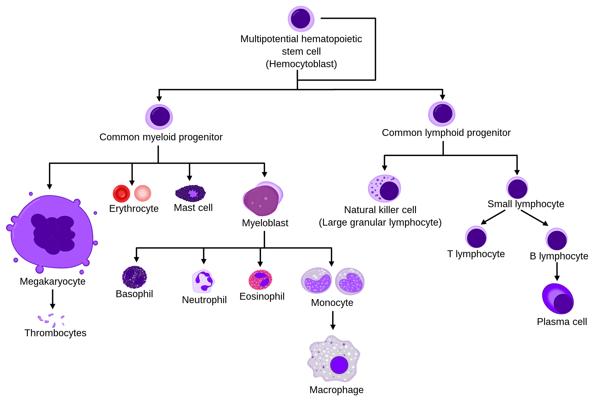
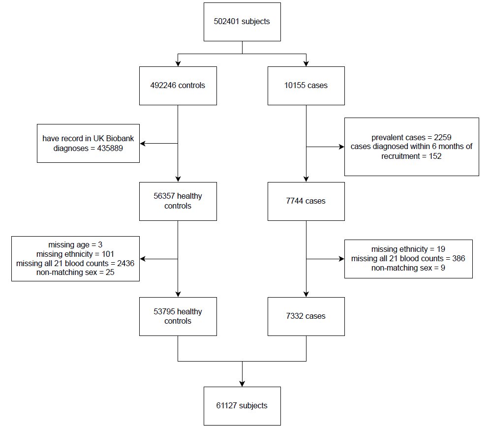
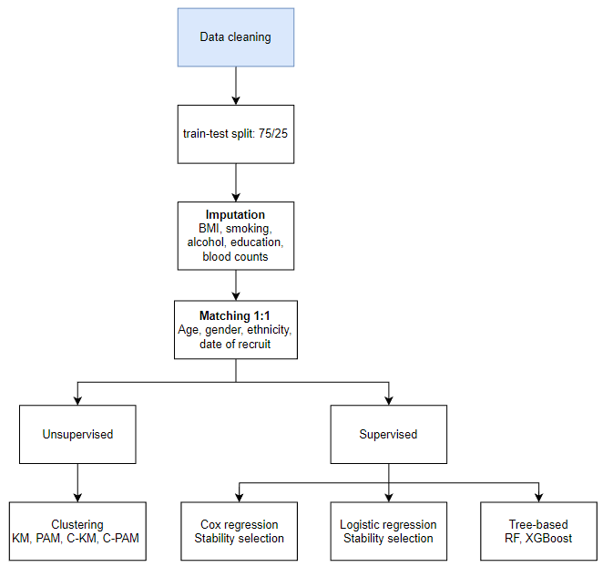
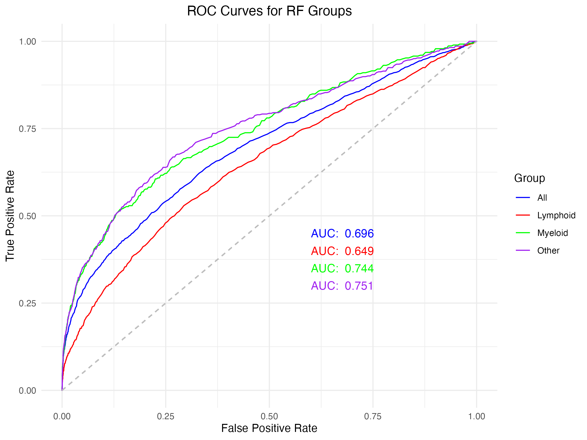
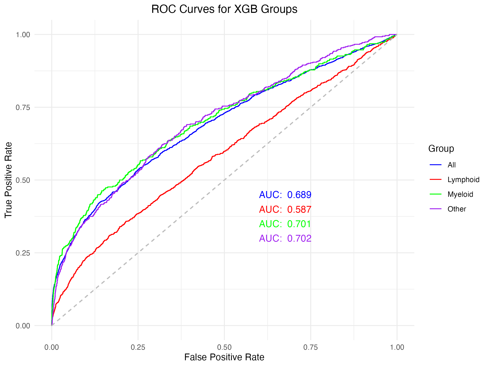
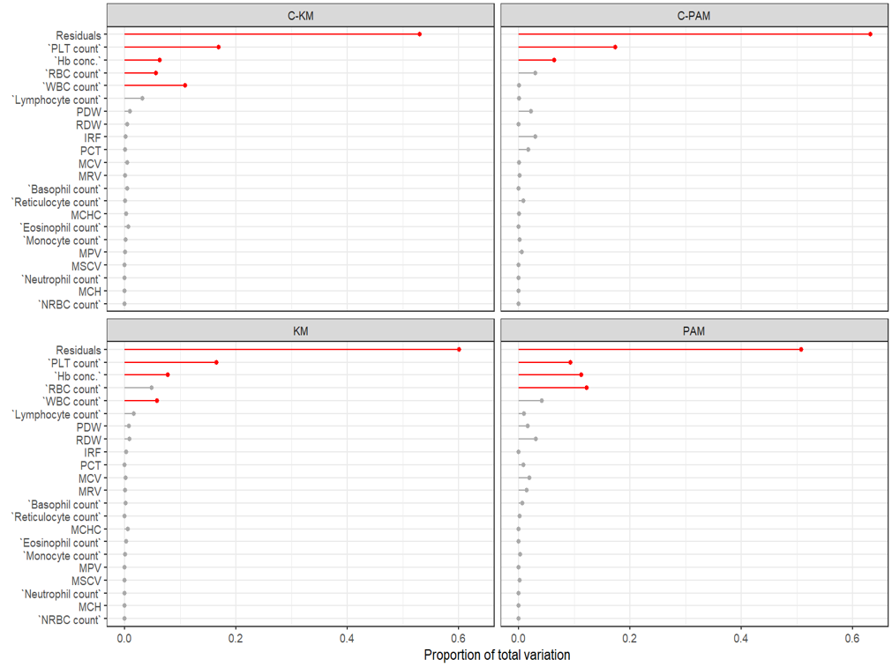
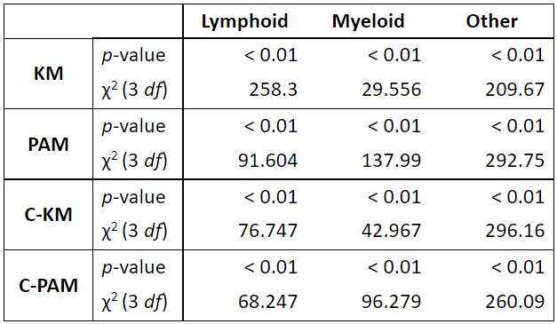
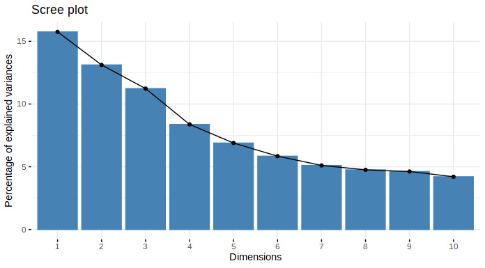

```{r setup, include=FALSE}
knitr::opts_chunk$set(echo = FALSE, eval = TRUE, comment = NA, fig.pos = "H", out.extra = "")
```

```{r packages, include=FALSE}
library(tableone)
library(tidyverse)
library(ggplot2)
library(gridExtra)
library(cowplot)
library(knitr)
source("../R/Functions_plot.R")
```


\clearpage


## Abstract
Blood cancer affects over 250,000 people in the UK and early diagnosis is essential for early intervention and treatment to improve patient outcomes and reduce mortality. Blood tests are important diagnostic tests for multiple blood cancer types and blood counts are demonstrated to be predictive of cancer progress in other types of cancers. This study uses UK Biobank data on blood count and demographic and behavioural cofactors to develop models for blood cancer risk prediction. Stability selection was employed for variable selection, followed by fitting Cox proportional hazards models and logistic regression models for prediction. Tree based models such as random forest and XGBoost were also explored. Clustering has been applied to look for potential blood count profiles that are predictive of blood cancer risk. The methods are compared using C-index for time-to-diagnosis outcome and AUC, F1, precision and recall for binary outcomes. 

Red blood cell distribution width and platelet distribution width were found to be important factors for blood cancer risk prediction. These results are coherent with previous results for other types of cancer. These could be incorporated into early diagnosis procedures.

## Introduction
Over 40,000 people are diagnosed with blood cancer each year in the UK, and over 250,000 people are currently living with blood cancer. [@bloodcancerukBloodCancerUK]. It is more common in adults aged 60 and above but can also affect children, adolescents and young adults [@Kucine2020]. Early diagnosis is key to improving health outcomes and reducing mortality. 

Blood cancers encompass a broad range of cancers that are classified by the type of blood cell type that is affected in the mutation [@Arber2016]. Generally the disease is progressive and resulting in changes in cell types with increases or decreases in concentration of blood cells types depending on the blood cancer type and corresponding blood cell lineage affected. Blood cancers can be caused by genetic abnormalities leading to abnormal changes in the formation of blood cells.

Using data for prediction of cancer has been a long term goal in medicine, back in 2014 one study demonstrated success in predicting leukaemia in patients based on the cell population data taken from full blood counts (FBC) using excel spreadsheet methods [@yang_determination_2014]. In the recent years, machine learning methods (ML) have improved prediction performance. Previous studies have performed similar attempts with good results assessing specific blood cancers such as leukemia as well as more broad classifications with significant improvements in accuracy [@el-halees2017]. This method is not unique to blood cancer but has been applied to other health conditions and it was demonstrated that higher platelet ratio is associated with increase in hospital mortaility in patients with myocardial infarction [@yaoRedBloodCell2023].

There are other approaches to use machine learning in diagnosis such as convoluted neural networks to identify abnormal leucocytes on histology slides with significant success however misclassification errors still exist especially between cell types that have similar lineage [@shahidsingh;@Wang2019]. Moreover, although there is literature available demonstrating prediction using blood counts for specific blood cancer types there has not been any studies aiming for prediction across a broad category of blood cancers. 

This study employs supervised and unsupervised machine learning techniques to identify blood biomarkers that could predict blood cancer and multiple sub-types of blood cancer. This could potentially identify early cancer biomarkers and develop into predictive models for early diagnosis, assisting improvement in clinical assessment, prognosis and treatment of myeloproliferative disease.

## Methods

### Outcome Definition
Blood cancer and subtypes were defined according to ICD 10 and ICD 9 codes. We merged the ICD 9 and ICD 10 groups which had corresponding diagnosis according to the WHO classification for blood cancer [@Arber2016]. If there was not a corresponding ICD10 code for the ICD9 code then this was added to the Other cancer group. We further grouped the blood groups according to the cell histology resulting in four subgroups classified as per the cell line: lymphoid, Myeloid, Dendritic and histiocytic cell and Other cancers. The sample size for Dendritic and Histiocytic cell group was small so it was not approriate to be included in further analyses. Figure 1 illustrates the cell lineage of a haematopoietic cell. 

```{r Cell Lineage of a Hematopoietic Cell, fig.cap="Cell Lineage of a Hematopoietic Cell", out.width = '100%', fig.align='center'}

```

### Exposures and Potential Confounders
The exposure variables of interest are blood counts measured in blood samples taken at baseline. There are 31 blood count variables available in the UK Biobank, some are mathematically related and can be derived from each other. Thus, in order to ensure blood counts included in this study are independent variables, the correlation between each pair of blood counts were calculated and for pairs with greater than 0.9 correlation, only one of the pair was kept. This lead to the final set of 21 blood counts, which covers descriptions of the number, size and size variation of myeloid and lymphoid cells, including white blood cell (WBC) count, red blood cell (RBC) count, red blood cell distribution width (RDW), nucleated red blood cell (NRBC) count, haemoglobin concentration (Hb conc.), mean corpuscular volume (MCV), mean corpuscular haemoglobin (MCH), mean corpuscular haemoglobin concentration (MCHC), platelet (PLT) count, platelet crit (PCT), mean platelet volume (MPV), platelet distribution width (PDW), lymphocyte count, monocyte count, neutrophil count, eosinophil count, basophil count, reticulocyte count, mean reticulocyte volume (MRV), immature reticulocyte fraction (IRF), mean sphered cell volume (MSCV). A set of potential confounders were identified, which include age, gender, ethnicity, BMI, smoking status, alcohol intake frequency and highest education level.

### Study Population
The study population arised from the UK Biobank prospective cohort study. Blood cancer cases were identified by linkage to Hospital Episode Statistics (HES) and death registry using the ICD 10 and 9 codes identified. Prevalent cases and cases diagnosed within 6 months of recruitment were excluded to prevent reverse causation. Participants who are not identified as cases in HES and death registry and without entries in UK Biobank ICD 10 & 9 diagnosis data fields were included as healthy controls. Participants with missing age, ethnicity, all 21 blood counts and has non-matching genetic and self-reported sex were also excluded. This lead to a final set of 61125 participants, including 6332 cases and 53796 healthy controls (Fig. 2).
```{r Data cleaning, fig.cap="Data cleaning process.", out.width = '100%', fig.align='center'}

```

### Analysis Plan
After data cleaning, the dataset is split into training (75%) and testing (25%) set. K-nearest neighbour imputation was used to impute missing values separately in train and test set. Cases and controls were then matched to 1:1 on age, sex, ethnicity and date of recruitment in the training set. After data processing, several supervised and unsupervised methods were applied to develop predictive models for blood cancer risk prediction using blood count, including penalised regression, tree-based methods and clustering (Fig. 3). The model evaluation metrics used were C-index for time-to-event outcomes and AUC, F1, precision and recall for binary outcome.
```{r analysis plan, fig.cap="Analysis plan.", out.width = '100%', fig.align='center'}

```

### Stability selection
Stability selection on Cox regression (blood cancer case-control status) and logistic regression (blood cancer subtype case-control status) was performed using the sharp package in R [@bodinier2021automated]. All covariates and blood count features were supplied to the models, the penalty factor argument was set to 0 for all covariates to keep them in all models and to 1 for blood count features to select a subset of blood count features. Two parameters, penalty parameter ($\lambda$) and selection proportion ($\pi$), are tuned by subsampling and maximising the stability score. A grid of parameter values was defined using the default setting in the `VariableSelection` function, which uses a sequence from 0.6 to 0.9 with 0.01 interval for $\pi$ and `LambdaGridRegression` function for generating $\lambda$ values. For each pair of parameter values, 100 models were built using subsamples from the training data. The stability score was defined using a likelihood function that measures the deviation from an unstable model that uniformly selects features and the most stable models would stably select and exclude blood count features across 100 iterations.  

After stability selection, unpenalised Cox regression and logistic regression models were fitted using all covariates and the selected blood counts. The models were then used to predict outcome in the test set and model evaluation metrics were calculated.

### XGBoost
XGBoost (XGB) models were trained for pooled cases and each subgroup [@chenXGBoostScalableTree2016]. Model tuning was done on a grid of parameters using the caret package [@kuhnBuildingPredictiveModels2008] with 3 repeats of 10-fold cross validation, minimising the loss function. The default loss function, log loss for binary outcome was used. The parameters tuned and parameter space include the number of trees (500, 1000, 1500) and maximum depth per tree (2, 4, 6). The parameters not tuned and their values were learning rate (0.2), gamma (0), col sample_by tree (1), minimum child weight (1) and subsample (1).

### Random Forest
Random forest (RF) was implemented using the randomForest package in R [@liaw2002]. Models were trained for pooled cancer cases and each sub-type. Each model was tuned on a grid of parameter values using 10-fold cross validation with 3 repeats maximising the out-of-bag (OOB) accuracy and computational efficiency. The parameters tuned and parameter space include the number of trees (250, 500, 1000, 1500) trees and the number of candidate variables at each split (1 to 7).

### Clustering
Cluster analysis was performed on blood counts to explore potential groups of observations that are associated with blood cancers, as well as to reduce dimensionality for further analysis. Multiple clustering methods and distance metrics were explored, K-Means clustering was implemented using kmeans from the stats package in R [@stats], Partitioning Around Medoids (PAM) was done using the package cluster [@cluster] and consensus clustering based on K-Means and PAM was done using the package ConsensusClusterPlus [@consensuscp]. The best number of clusters is determined using the maximum silhouette score and elbow method for within cluster sum of squared error for K-Means and PAM and by inspecting the consensus CDF and using elbow method for change in area under the consensus CDF for consensus clustering. For simplicity in presentation, consensus K-Means and PAM would be referred to as C-KM and C-PAM in the rest of the report.

For each method, after cluster membership had been determined, ANOVA tests were done between each blood count and clusters membership from each method to investigate the blood counts that contribute to each cluster. Chi-squared tests were done between clusters and each blood cancer subtypes and the p-values were used to assess if there were significant association between cluster membership and blood cancer.

Then, the cluster memberships in the test set were predicted using two methods. The first involves fitting a multinomial logistic regression for cluster membership against all blood counts and use the model to predict cluster membership in the test set. The second uses the nearest neighbour method, where the distance between test set and train set participants were calculated based on their blood count values using Manhattan distance, and the majority vote from the nearest 5 data points were used as the predicted membership. Finally, logistic regression models of blood cancer outcomes against clusters and covariates were fitted on the training set. The models were used to predict the outcome in the test set. Evaluation metrics were then calculated for each model.

## Results
Table 1 shows that matching has susccessfully made the distribution of age, sex and ethnicity similar between cases and controls. The train set was not matched on BMI, smoking status, alcohol intake frequency and highest education level, but their distributions are also similar between the two groups.
```{r TableOne, results='asis'}
# import data
tab <- read.csv("../output/TableOne.csv")
# remove colname for the variable column
colnames(tab)[2] <- " "
# keep leading white space
tab$` ` <- gsub(" ", "&nbsp;", tab$` `, fixed=TRUE)
# get the table
kable(tab[,2:4], caption = "Demographics of the matched dataset.", align = "lrr")
```

### Stability Selection

#### Cox Regression
Seven blood count features were stably selected for the time to blood cancer diagnosis outcome. In the unpenalised model, immature reticulocyte fraction was removed due to having extremely large hazard ratio. The removal did not affect the model accuracy. For the other variables, higher red blood cell count is associated with lower hazard of blood cancer diagnosis, whereas red blood cell distribution width and platelet distribution width are found to associated with higher hazard (Fig. 4).

#### Logistic Regression
For the blood cancer subtypes, nine blood counts were stably selected for all types combined, seven for lymphoid, four for myeloid and six for other types of blood cancers. Among the selected features, red blood cell distribution width was selected for all subtypes (Fig. 5). Counts of white blood cells such as lymphocyte and monocyte, platelet critical value and haemoglobin concentration were selected for lymphoid type. For the myeloid type, the blood counts selected were all related to red blood cells and platelets which are myeloid cells. For the others type, a mix of blood counts were selected.

```{r Cox regression, fig.cap="Results for Cox regression model. A shows the selection proportion for each blood count feature, the stably selected features are labeled in red. B shows the hazard ratios for an unpenalised Cox regression model fitted using selected blood counts (orange) and all covariates (blue).", out.width="70%", fig.align='center'}
# selprop plot
df_selprop <- readRDS("../output/Reg_Cox_Selprop.rds")
p1 <- plotVarImp(data = df_selprop, varname = 1, varimp = 2, cutoff = 0.9)
# forest plot
df_forest <- readRDS("../output/out_coxph.rds")
df_forest <- df_forest %>% filter(p <= 0.05)
df_forest$varname <- factor(df_forest$varname, levels = df_forest$varname)
df_forest$IsBC <- as.factor(c(rep("Covariate",11), rep("Blood count",6)))
p2 <- plotForest(data = df_forest, 
                 varname = 8, estimate = 2, CI_l = 6, CI_u = 7, IsBC = 9,
                 typeOfEstimate = "Hazard Ratio", title = "")
# arrange plots
p3 <- ggdraw() +
  draw_plot(p1, 0, 0, .40, 1) +
  draw_plot(p2, .40, 0, .60, 1) +
  draw_plot_label(c("A", "B"), c(0, .60), c(1, 1), size = 10)

p3
```


```{r Logistic ss, fig.cap="Stability selection results for logistic regression against blood cancer subtypes.", out.width="70%", fig.align='center'}
df_selprop <- readRDS("../output/log_selprop.rds")
p1 <- plotVarImp2(data = df_selprop, varname = 1, varimp = 2, model = 4, cutoff = 0.9)
p1
```

The unpenalised logistic regression models found that the selected blood counts were all significantly associated with the outcomes, except for WBC count for lymphoid type, which was marginally significant (*p* = 0.055). Comparing the odds ratios of the blood counts across the models, the direction of effect for all blood counts were consistent across the subtypes (Fig. 6). Higher RBC count was found to associate with lower odds of blood cancer. Haemoglobin concentration and platelet critical value were found to associate with lower odds of lymphoid type cancer. Counts of lymphocyte and monocyte were found to associate with higher odds of lymphoid sub-type. Larger red blood cell and platelet distribution width and higher white blood cell counts were found to be deleterious, consistent with results from Cox regression. Ir fraction is again removed from the unpenalised models of myeloid type blood cancer due to an extremely high OR. The removal improved the model accuracy marginally from AUC = 0.69 to AUC = 0.70. Among the confounders included in the model, similar trends were observed for all subtypes. Smoking increases the odds and increasing alcohol intake frequency decreases the odds of blood cancer.

```{r Logistic, fig.show='hold', fig.cap="Unpenalised logistic regression results for blood cancer subtypes."}
# plot for bc
df1 <- readRDS("../output/log_bc.rds")
p1 <- ggplot(df1, aes(y = fct_rev(varname))) + 
  theme_classic() +
  geom_vline(xintercept = 1, linetype="dashed") +
  geom_point(aes(x=estimate, color = model), shape=15, size=3) +
  geom_linerange(aes(xmin=CI_l, xmax=CI_u, color = model)) +
  labs(x="Odds Ratio", y="") +
  theme(legend.position = "none", legend.title = element_blank()) +
  ggtitle("")

# plot for covars
df2 <- readRDS("../output/log_covar.rds")
p2 <- ggplot(df2, aes(y = fct_rev(varname))) + 
  theme_classic() +
  geom_vline(xintercept = 1, linetype="dashed") +
  geom_point(aes(x=estimate, color = model), shape=15, size=3) +
  geom_linerange(aes(xmin=CI_l, xmax=CI_u, color = model)) +
  labs(x="Odds Ratio", y="") +
  theme(legend.position = c(0.7,0.2), legend.title = element_blank()) +
  ggtitle("")

# arrange plots
ggdraw() +
  draw_plot(p1, 0, 0, .40, 1) +
  draw_plot(p2, .40, 0, .60, 1)
```

### Tree-based Methods
The AUC values demonstrate that the random forest models performed better than XGBoost across all cancer and subgroups. The prediction accuracy for XGB models of all subtypes were similar except for lymphoid type (Fig. 7).
```{r, out.width='50%', fig.show='hold', fig.cap='ROC curves and AUC for random forest and XGBoost models', fig.pos = "H"}
# RF ROC plot combined image


# XGB ROC plot combined image

```

In order to compare the feature importance from both models, the gain metric for XGB models and mean decrease in Gini index for RF were used as the evaluation metric for each variable. Figure 5 showed the scaled scores and the top 5 variables for each model were coloured in red (Fig. 8).

The mean decrease in Gini coefficient measures how each variable contributes to the homogeneity of the node and leaves in the resulting RF. Thus variables with higher scores contribute to better discrimination of the cases and controls. The gain metric assesses the contribution of each feature to each tree in the XGBoost model. Higher gain metric suggests that the feature contributes more to the final prediction.

```{r Varimp, fig.show='hold', fig.cap='Variable Importance plots for random forest (left) and XGB (right) models. The top 5 variables for all models are coloured in red.', fig.ncol=1, out.width="50%"}
df_rf <- readRDS("../output/RF_varimp.rds")
df_xgb <- readRDS("../output/XGB_varimp.rds")
p1 <- plotVarImp3(data = df_rf, varname = 2, varimp = 1, model = 3, criteria = 4)
p2 <- plotVarImp4(data = df_xgb, varname = 2, varimp = 1, model = 3, criteria = 4)
p1
p2
```

### Clustering
The silhouette, elbow method and change in area under the consensus CDF all demonstrated that four was the best number of clusters (Fig. 9). The clusters from each method were visualised on a grid using PC1 and PC2 from a PCA of blood counts (Fig. 10). Consensus clustering using K-Means identified four distinguishable clusters. K-Means assigned the north-west outliers to cluster 3, PAM mixed clusters 2 and 3 and C-PAM mixed clusters 1 and 4.

```{r out.width='50%', fig.ncol = 2, fig.show='hold', fig.cap='Silhouette scores, sum of squared error and change in area under the consensus CDF curve for C-KM (bottom left) and C-PAM (bottom right).', fig.pos = "H"}
knitr::include_graphics(c("silhouette.png","elbow.png", "C-KM_dA.png", "C-PAM_dA.png"))
```

```{r Visualise cluster, out.width='70%', fig.align='center', fig.cap="Visualisation of clustering results using PC1 and PC2 from PCA of blood count variables.", echo=FALSE}
df_pc <- readRDS("../output/ClusPCA.rds")

p1 <- ggplot(data = df_pc, aes(x = PC1, y = PC2, color = km4)) + 
  geom_point(alpha = 0.5) +
  labs(color = "KM")

p2 <- ggplot(data = df_pc, aes(x = PC1, y = PC2, color = pam4)) + 
  geom_point(alpha = 0.5) +
  labs(color = "PAM")

p3 <- ggplot(data = df_pc, aes(x = PC1, y = PC2, color = kmCons4)) + 
  geom_point(alpha = 0.5) +
  labs(color = "C-KM")

p4 <- ggplot(data = df_pc, aes(x = PC1, y = PC2, color = pamCons4)) + 
  geom_point(alpha = 0.5) +
  labs(color = "C-PAM")

# arrange plots
p_combined <- grid.arrange(p1, p2, p3, p4, ncol = 2)
```
ANOVA analysis results showed that platelet count and haemoglobin concentration are associated with the cluster memberships from all clustering methods. WBC and RBC counts were also associated with C-KM (Fig. 11). The chi-squared test showed significant association between blood cancer subtypes and clusters from all methods (Fig. 12). For the logistic regression models of blood cancer and subtypes against the blood counts, cluster 1 was used as the reference level as it is the most consistent group across the methods. All methods have identified a cluster that has higher odds of the other type for blood cancer. The PAM methods identified a cluster that has lower odds of blood cancer (Fig. 13).
```{r cluster BC, out.width='70%', fig.cap='ANOVA test results between blood count and cluster memberships.', fig.pos = "H", fig.align='center'}

```

```{r cluster_chi, out.width='70%', fig.show='hold', fig.cap='Chi-squared test results between each cluster memberships and blood cancer sub-types.', fig.pos = "H", fig.align='center'}

```

```{r cluster_out, out.width='70%', fig.align='center', fig.cap="Logistic regression results for blood cancer and sub-types against the clusters", echo=FALSE}
df <- readRDS("../output/Clus_BC.rds")

p1 <- ggplot(df, aes(y = fct_rev(varname))) + 
  theme_classic() +
  geom_vline(xintercept = 1, linetype="dashed") +
  geom_point(aes(x=estimate, color = model), shape=15, size=3) +
  geom_linerange(aes(xmin=CI_l, xmax=CI_u, color = model)) +
  labs(x="Odds Ratio", y="") +
  theme(legend.position = "right", legend.title = element_blank()) +
  ggtitle("")

# arrange plots
p1
```

### Comparison of Model Prediction Accuracies
Overall, including blood count features in modeling improved model performances. The clustering methods all had similar accuracy and are lower than stability selected blood counts model. For clustering, the two methods for predicting test set membership had similar performances, with nearest neighbour method being slightly lower than multinomial logistic regression. For the time to event outcomes, the C-indexes when testing on test set is higher than training C-index, suggesting that the models were not overfitting the data (Table 2). For the binary outcomes, the tree-based models had the best performance overall, with random forest out-performing the XGBoost models (Fig. 14). All models have similar training and testing AUC and recall, so they are not likely to be overfitted. The exceptions are XGBoost models for the blood cancer subtypes. Although the prediction accuracy on test set is comparable to the other methods, the training metrics showed that they are overfitted. For all models, the precision, and as a result, F1 score, are very low in the test set.
```{r Compare Cox regression, results='asis'}
# import data
tab1 <- read.csv("Compare_tte.csv")
colnames(tab1)[c(3,4)] <- c("C-index (Train)", "C-index (Test)")
tab1[2,1] <- "Stability selection"
# get the table
kable(tab1, caption = "Cox regression models were compared using C-index. For clustering methods, results from predicting test set cluster membership using multinomial logistic regression or nernest neighbour were presented respectively.", align = "llrr")
```

```{r Compare logistic, fig.show='hold', fig.cap="Classfication models for the binary outcomes were compared using AUC, F1, precision and recall.", out.width = '70%', fig.align='center'}
# import data
knitr::include_graphics(c("Compare_b1.png", "Compare_b2.png"))
```

## Discussion
Overall, we demonstrated that blood counts can be used to improve performance of predictive models. All models in this study can predict the diagnosis of blood cancer with a true positive rate of around 0.6. The clustering models have lower accuracy than the models using blood counts. This is expected as some information might be lost while clustering all blood count information into a single cluster membership variable. Also, clustering methods are unsupervised so information that is not related to the outcome could also have been captured in the cluster membership. For the binary outcome, all models have low precision in the test set, this is likely due to the low prevalence of blood cancer cases in the test set.

Tree-based methods have better performance than penalised regression and models using clustering results. This could be due to the fact that random forest and XGBoost are ensemble methods which take the consensus from multiple predictors to construct more accurate predictions. Also, non-linear relationships and interactions between variables are taken into account naturally by the tree structures.

The performance of the RF and XGB models determined by AUC value demonstrated that the RF models outperformed XGB models in all categories. Although the classification accuracy for either model is not high enough to compare to human standards and we do not have that information available to compare. The reason for the low accuracy we put forward is that each blood cancer category contains a very broad collection of blood cancer subcategories and performance may be improved a more refined categorization of blood cancers. The XGBoost demonstrates overfitting with the data for sub-group and further work needs to be done to optimise the training to prevent this.

In this study, several blood count features were consistently found to be associated with blood cancer. RDW and PDW were identified by penalised regression to be important feature for all blood cancer types. Both are associated with higher odds of blood cancer, where as the amount of RBC and platelet are associated with lower odds of blood cancer. This suggests that higher variation in RBC and platelet size is associated with a higher risk of blood cancer. These finding as in coherent with previous findings in other cancers [@montagnana_red_2016], including breast cancer [@seretis_is_2013] and colon cancer [@ay_is_2015]. Haemoglobin concentration and platelet critical value were found to be associated with lower odds of lymphoid type cancer. This could be due to a higher proportion of lymphocytes that occupy the blood and also signs of anaemia in lymphoid type cancer. High white blood cell counts were found to be deleterious for blood cancer, which was expected as the cells proliferate in blood cancer.

The feature importance plots (Fig. 8) identify the similar top 5 features between XGBoost and RF. In XGBoost the features are in a higher proportion. This is likely due to the design of the RF and XGB algorithms in that random forest has a random selection of features when building trees and so more variables would be part of that selection process whereas in XGBoost uses boosting to combines weak learners sequentially to allow errors to correct the previous one. This would mean that less variables are selected rather than the random approach used by the RF algorithm.

It is reassuring that similar top 5 variables are selected across both algorithms. It also indicates that these are blood markers that should be further assessed, and that they are potential identifiers of future cancer diagnosis, although it does not indicate the direction of the variable's effect on predicting cancer. The lymphocyte count is selected highly in XGB and RF models in the lymphoid group for the same reason. In the Other group, platelet count is a important feature in prediction which has a myeloid progenitor but the cancer types are heterogenous in the Other group so it is more challenging to provide a reason why this is selected and should warrant further analysis of this subgroup.

In the RF model for pooled blood cancer and lymphoid type, BMI is an important variable for discriminating cases and controls and is supported with similar findings in the literature, where BMI is a risk factor for all cancer [@taghizadehBMILifetimeChanges2015]. It is interesting that although most blood cancers have a genetic cause for them, there are also lifestyle factors such as BMI as a potential important feature in prediction for blood cancer. 

There are no other attempts at predicting broad cancer groups found in the literature to compare our models to although in comparison to human categorisation our models still need significant improvement. Some studies have used blood biomarkers to predict ovarian cancer using a range of ML methods and have similarly found that random forest algorithm performed the best although they have achieved much higher AUC results than our models likely due to their more narrow objective [@kawakami2019; @ma2021].

In the cluster analysis, the blood counts most associated with cluster membership were also identified to be associated with blood cancer in the other models, which suggests that the clusters could have captured useful information for the prediction of blood cancer. From the chi-squared test and logistic regression results, the clusters were found to be associated with risk of blood cancer. All methods identified a group that was predicted to associate with higher odds of others type of blood cancer. As the others sub-group is a heterogeneous group, no good hypothesis could be proposed for this finding. Further characterisation for this cluster and the others sub-group for blood cancer should be done to investigate this association.

## Limitations
For early diagnosis of blood cancer, the sensitivity of the models are important, however the cost accompanied with false positives include possible further screening and diagnostic tests, which may also increase the burden to the health care system if the number of false positives is high. Thus, our classification models are not suitable for application in the clinical setting due to the low precision.

The difficulty of having a broad base cancer classification approach is that cancer classifications are based on cell lineage affected and the cell type that is affected. We attempted to maintain that classification when we categorized into our 2 groups based on myeloid and lymphoid progenitor cells. It is more difficult with the other group not a homogenous cancer classification group and so is harder to interpret, this does make drawing clear conclusions from findings of Other group more challenging. 

In the future, we aim to link with genomic data for better understanding of patient specific disease biology and develop precision medical intervention for each patient. This could also be developed into a risk stratification and prognostic tool by including more data such as treatment modality and deaths for predicting overall survival.

## Conclusion
This study identified blood count features that are predictive of blood cancer at least 6 months before diagnosis. Results were the consistent across the methods and with previous studies. Higher RBC count was associated with lower risk of blood cancer and larger size variation in red blood cells and platelets were assoociated with higher risk of blood cancer. Predictive models were built that can predict blood cancer diagnosis at least 6 months before the event with AUC of around 0.6, but the precision is low in population with low incidence of blood cancer. Random forest has better performance than penalised regression and XGBoost. Clusters that are associated with blood cancer were identified based on blood count variables and require further characterisation.


## Appendix
```{r PCA, fig.cap="Percentage of variance explained by each PC."}

```

```{r BC and PAM, fig.show='hold', fig.cap="Distribution of blood counts by cluster from PAM"}
bcdata <- readRDS("../output/ClusBC.rds")
par(mfrow=c(3,3))
for (i in 1:21){
  boxplot(bcdata[,i] ~ as.factor(bcdata$pam4), ylab = colnames(bcdata)[i], xlab = "")
}
```

```{r BC and ConsKM, fig.show='hold', fig.cap="Distribution of blood counts by cluster from Consensus K-Means"}
par(mfrow=c(3,3))
for (i in 1:21){
  boxplot(bcdata[,i] ~ as.factor(bcdata$kmCons4), ylab = colnames(bcdata)[i], xlab = "")
}
```

## Reference


